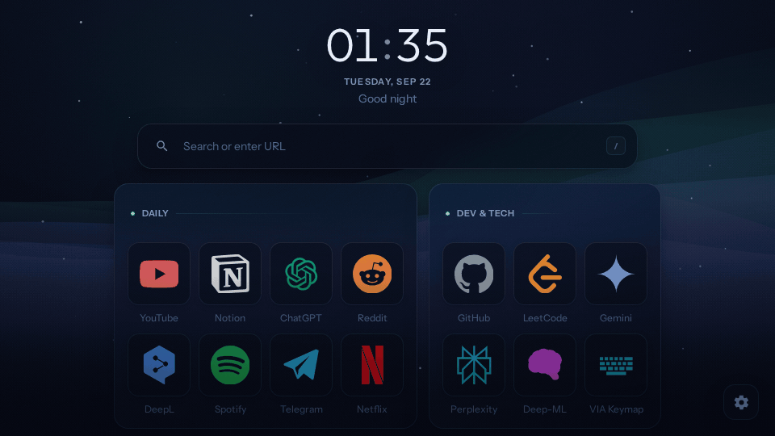
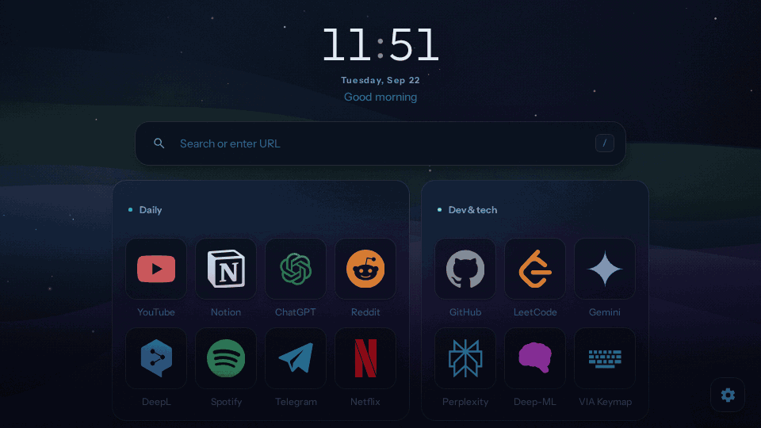
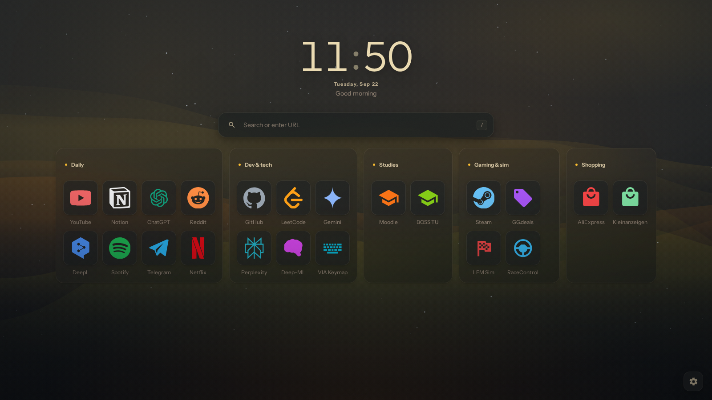
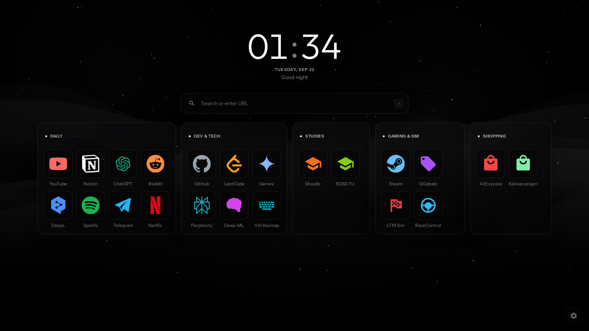
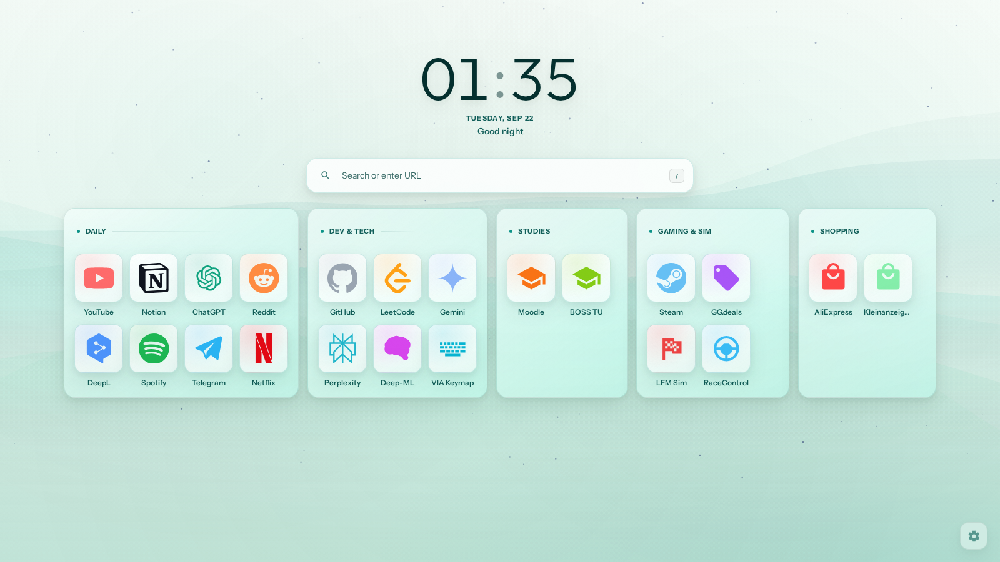
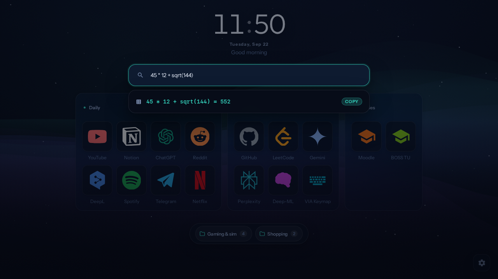
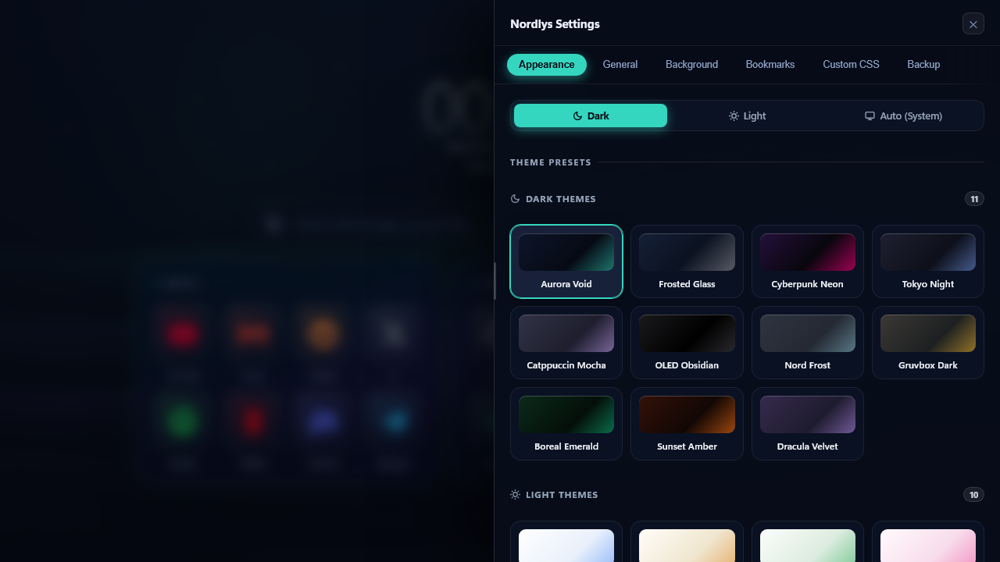
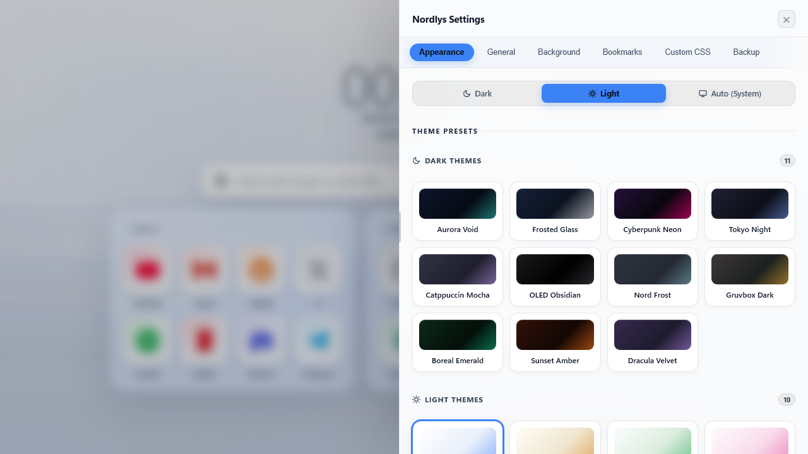

# Nordlys

A new tab page for Chrome that opens instantly and looks like something you'd actually want to stare at all day. Frosted glass, a live aurora painted on canvas, and bookmarks organized the way you organize them, not the way the browser thinks you should.

No frameworks, no build step, no analytics. Plain JavaScript and CSS, everything stored on your machine.

## Why this exists

I wanted a start page as fast as Tabliss and as customizable as nightTab, and neither quite got there. Tabliss is quick but you can't shape it much. nightTab bends any way you want but my setup took ages to load even on decent hardware. So this is the attempt to have both: the page renders in one DOM pass, the shader pauses the moment the tab loses focus, and pretty much every visible surface has a knob somewhere in settings.

## Themes

21 built-in themes, 11 dark and 10 light, and they differ for real: each one drives the background gradient, the glass tint, and the colors of the canvas shader itself. Gruvbox gets an amber aurora, Boreal gets an emerald one, OLED Obsidian stays pure black with faint graphite curtains.

| Gruvbox Dark | OLED Obsidian | Mint Breeze |
| :---: | :---: | :---: |
|  |  |  |

There's a Dark / Light / Auto switch (Auto follows your OS and flips live), and a theme studio where you pick seven colors and a font and save the result as your own preset. If none of that is enough, a live CSS editor with a class reference is built in.

## What else it does

- **Bookmarks as folders.** Drag tiles between folders, drag whole folders around, resize a folder's column count by pulling its corner, fold folders into a small dock at the bottom. Right click anything to edit it in place.
- **Icons your way.** A built-in vector library with auto-detection by domain, site favicons, any image URL, a local file, or a monogram. There's a small cropper studio with pan, zoom, and rotate for when a logo comes with junk around it.
- **Search that does math.** Type `45 * 12 + sqrt(144)` and the answer appears above the suggestions, one click to copy. Ten engines to pick from (Google, DuckDuckGo, Bing, Brave, Ecosia, Yandex, YouTube, GitHub, Reddit, Wikipedia), bang shortcuts like `!gh` and `!w`, plus your own bookmarks and recent searches in the same dropdown.
- **Backgrounds.** Four canvas modes (aurora, starfield, mesh orbs, pointer-following dust), or your own image / looping video stored locally in IndexedDB, with blur and dim sliders.
- **Glass tuning.** Blur radius, saturation, translucency, border sheen, corner radius, tile size, grid spacing, icon shape, glow, hover animation. Every slider updates the page while you drag it.
- **8 languages.** English, Russian, Spanish, German, French, Japanese, Chinese, Turkish.
- **Import and export.** Netscape HTML bookmarks from any browser in, JSON or HTML back out.

| Settings, dark theme | Settings, light theme |
| :---: | :---: |
|  |  |

## Performance

The board is built with a single `DocumentFragment` and swapped in with `replaceChildren`, so first paint doesn't reflow. Edits patch individual tiles instead of re-rendering the page. The shader is time-based (same speed on 60 and 144 Hz panels), caps device pixel ratio at 1.5, and fully stops via the Page Visibility API when the tab is hidden, so idle CPU cost is zero.

## Privacy

Everything lives in local storage and IndexedDB. The only network requests the extension can make are ones you trigger yourself: search suggestions while you type (can be turned off in Settings), and icon downloads when you paste an image URL. There is no `<all_urls>` permission and no telemetry of any kind. Details in [PRIVACY.md](PRIVACY.md).

## Install

1. Download or clone this repository.
2. Open `chrome://extensions` and turn on **Developer mode**.
3. Click **Load unpacked** and select the project folder.
4. Open a new tab.

Works in Chrome, Brave, Edge, and other Chromium browsers. Publishing steps for the Chrome Web Store are in [RELEASE_GUIDE.md](RELEASE_GUIDE.md).

## License

MIT. See [LICENSE](LICENSE).
