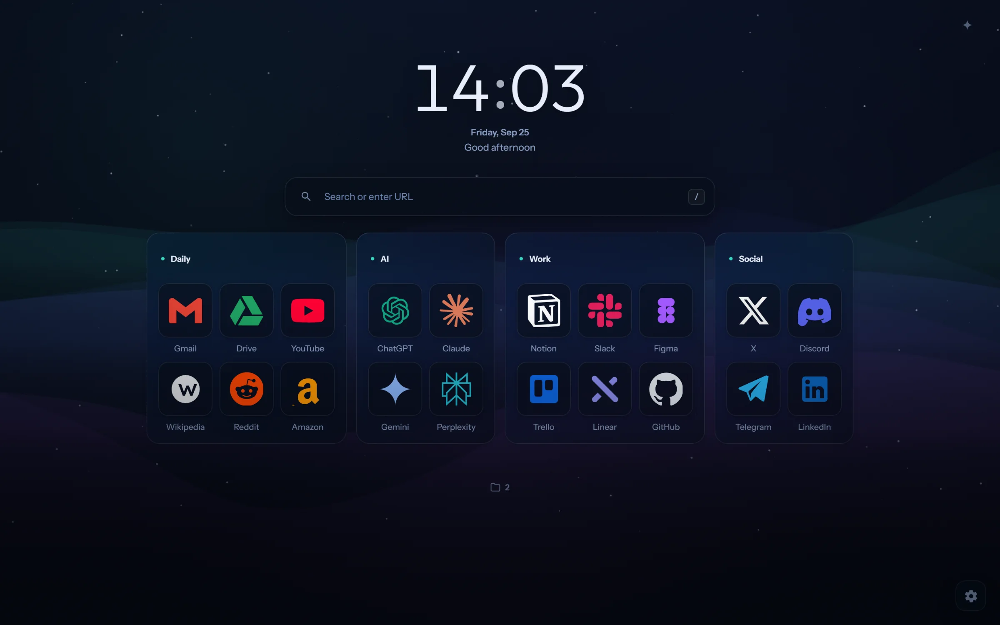
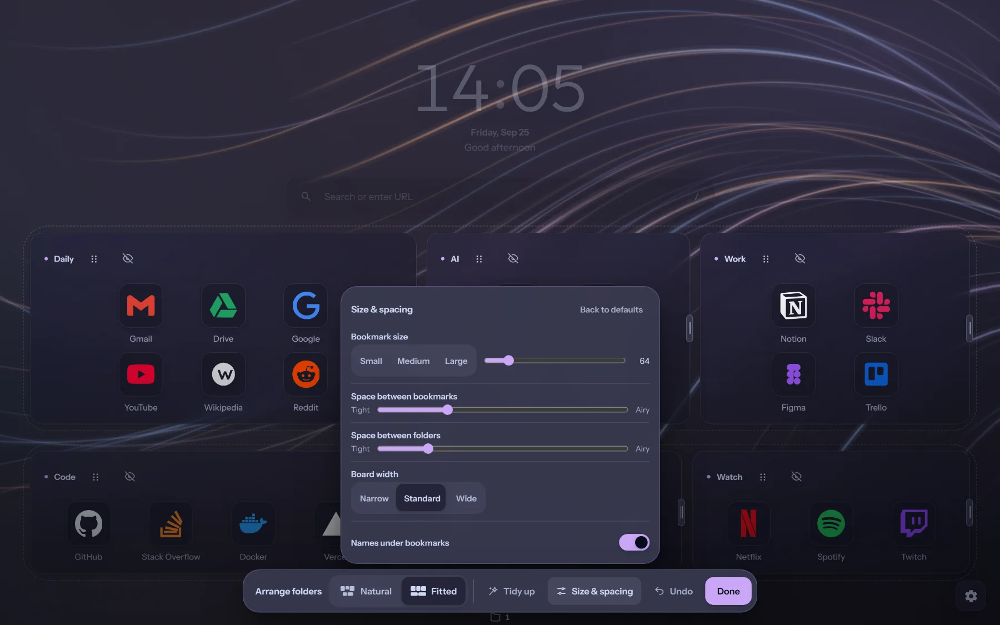
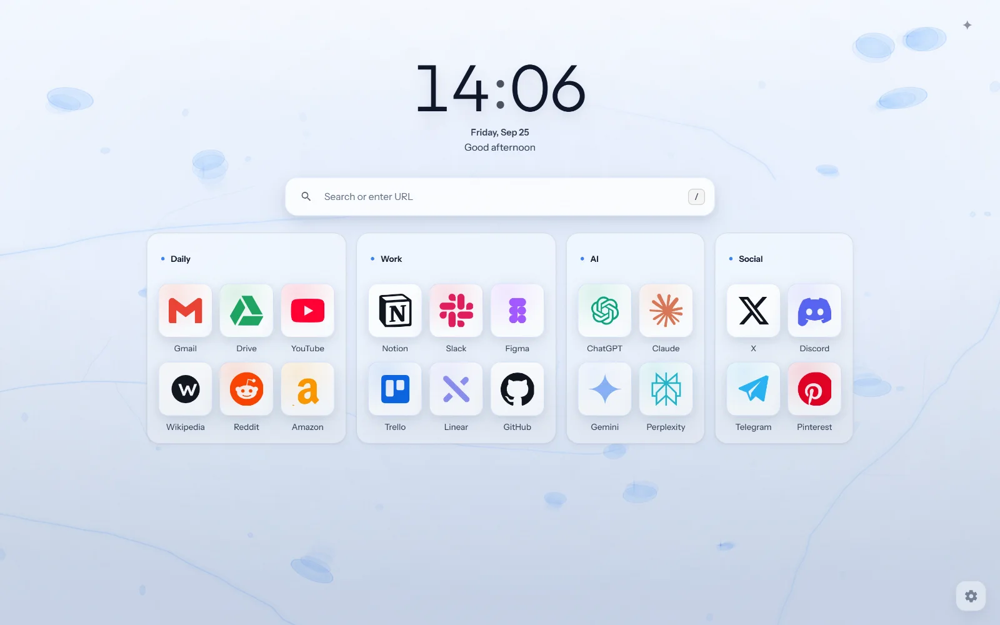
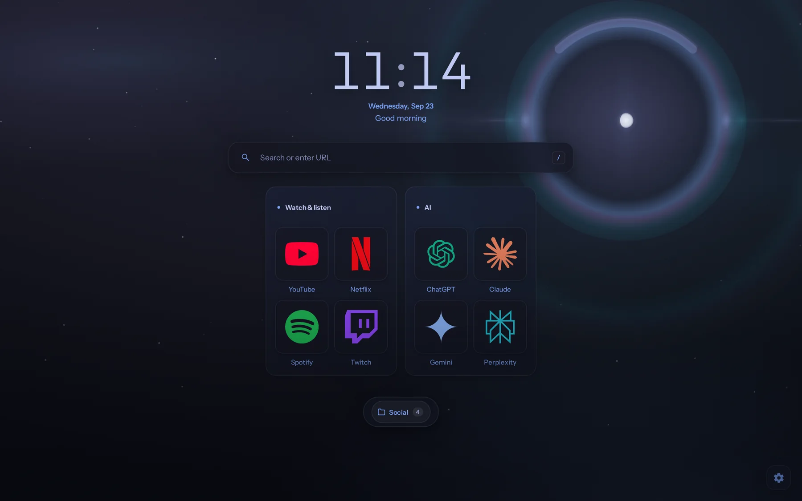
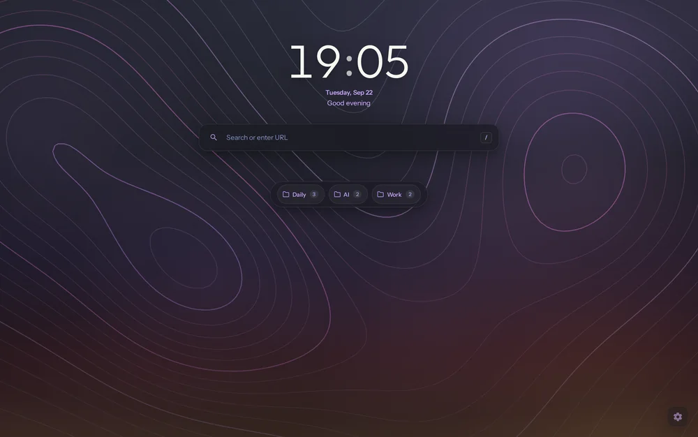

<p align="center">
  
</p>

<h1 align="center">Nordlys</h1>

<p align="center">
  A new tab page for Chrome: your bookmarks in folders you arrange yourself,<br>
  over a sky drawn on your own machine.
</p>

<p align="center">
  <a href="https://sa1ntsinner.github.io/nordlys-tab/">Website</a> ·
  <a href="#install">Install</a> ·
  <a href="PRIVACY.md">Privacy</a> ·
  <a href="CHANGELOG.md">Changelog</a>
</p>

<p align="center">
  
</p>

## What it does

- Folders go where you drag them, and the board shows where one will land before you let go. Fitted runs every row edge to edge, and bookmark size, spacing and board width sit in the same panel, each with Undo.
- Search a brand by name for a clean vector icon, kept on your machine. Chrome's favicon, an image address, a file or a letter work too, and an icon remembers the addresses it came from.
- Six scenes (Nordlys, Halo, Silk, Frost, Contour and Fjord) can follow the time of day in your time zone. Your own picture or looping video works as well.
- 21 themes, light and dark. The sky behind the clock and the search box is measured as it moves and held back just enough to keep the text readable.
- The search box does arithmetic, takes commands after `>` (`theme nord`, `move YouTube to Daily`) and sends searches to the engine you set in Chrome.
- A folder can follow one of your Chrome bookmark folders. It asks to read bookmarks only when you link one.
- Eight languages: English, Russian, Spanish, German, French, Japanese, Chinese and Turkish.

| Arrange | Themes |
| :---: | :---: |
|  |  |
| **Icons** | **Time of day** |
|  |  |

## Install

Load it from source:

1. Download or clone this repository.
2. Open `chrome://extensions` and turn on Developer mode.
3. Choose Load unpacked and pick the folder.

It works in Chrome, Edge, Brave and other Chromium browsers.

## Privacy

Settings and bookmarks stay in Chrome's local storage. There is no account, no analytics and no remote code. Nordlys goes online only when you ask: icon search sends the name you typed to Iconify after you press Search, and a pasted image address is fetched for its preview. The details are in [PRIVACY.md](PRIVACY.md).

## Development

Plain JavaScript and CSS with no build step.

```sh
npm install
npm test              # lint, unit and browser tests
npm run artwork       # store and README pictures, taken from the running extension
npm run site          # the website, assembled in _site/
```

Nordlys is still a beta. The version number can't say so, since the store only accepts numbers that go up, so it's said here instead. Every update that migrates your setup keeps a restore point.

## License

MIT. See [LICENSE](LICENSE).
