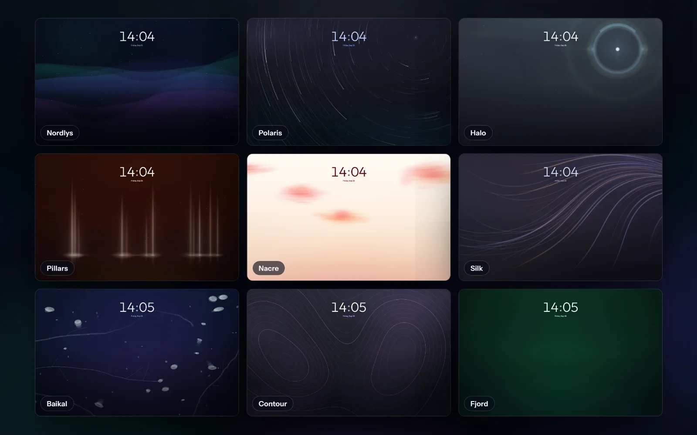

<p align="center">
  
</p>

<h1 align="center">Nordlys</h1>

<p align="center">
  A Chrome new tab page with bookmark folders and animated backgrounds.
</p>

<p align="center">
  <a href="https://chromewebstore.google.com/detail/nordlys/fepiibfbbjhaoldgcfpfcikbonnjbfdc">Chrome Web Store</a> ·
  <a href="https://sa1ntsinner.github.io/nordlys-tab/">Website</a> ·
  <a href="PRIVACY.md">Privacy</a> ·
  <a href="CHANGELOG.md">Changelog</a>
</p>

<p align="center">
  
</p>

I wanted a new tab page with my bookmarks and something nice to look at, so I made one.

- Keep bookmarks in folders. Move the folders around, adjust tile size and spacing, and undo changes.
- Pick from 9 animated backgrounds and 21 themes (11 dark, 10 light), or use your own picture or looping video.
- Search with the engine set in Chrome. The box also does math and takes commands after `>`, such as `theme nord`.
- Press Search to find brand icons from Iconify's Simple Icons set. You can also use a site's favicon, an image link or a letter.
- A folder can mirror a Chrome bookmark folder. Nordlys only reads it.
- It's in English, Russian, Spanish, German, French, Japanese, Chinese and Turkish.
- There's no account and no tracking.

<p align="center">
  
</p>

## Install

Install it from the [Chrome Web Store](https://chromewebstore.google.com/detail/nordlys/fepiibfbbjhaoldgcfpfcikbonnjbfdc). It also works in Edge, Brave and other Chromium browsers.

To run it from source instead:

1. Download or clone this repo.
2. Open `chrome://extensions` and turn on Developer mode.
3. Click Load unpacked and pick the folder.

## Privacy

Settings and bookmarks stay on your device. Searches go through Chrome to your chosen search engine when you press Enter. Brand icon searches contact Iconify only after you press Search. Pasted image links may also load online. See [PRIVACY.md](PRIVACY.md) for the full details.

## Development

There's no build step. The extension uses plain JavaScript and CSS.

```sh
npm install
npm test          # lint, unit and browser tests
npm run artwork   # store and site pictures, taken from the running extension
npm run site      # builds the website into _site/
```

Nordlys is still a beta. The version is 2.x because Chrome Web Store versions can only go up. Updates that change how your setup is stored keep a restore point first.

## License

MIT licence. See [LICENSE](LICENSE).
