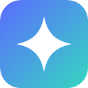
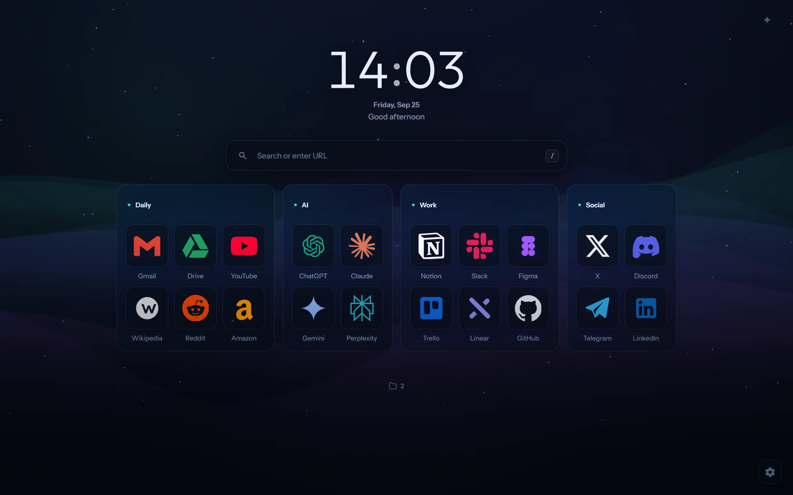
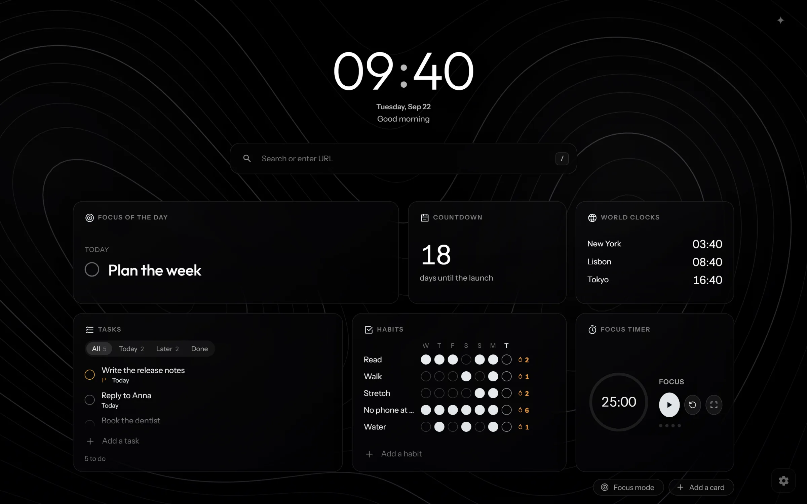
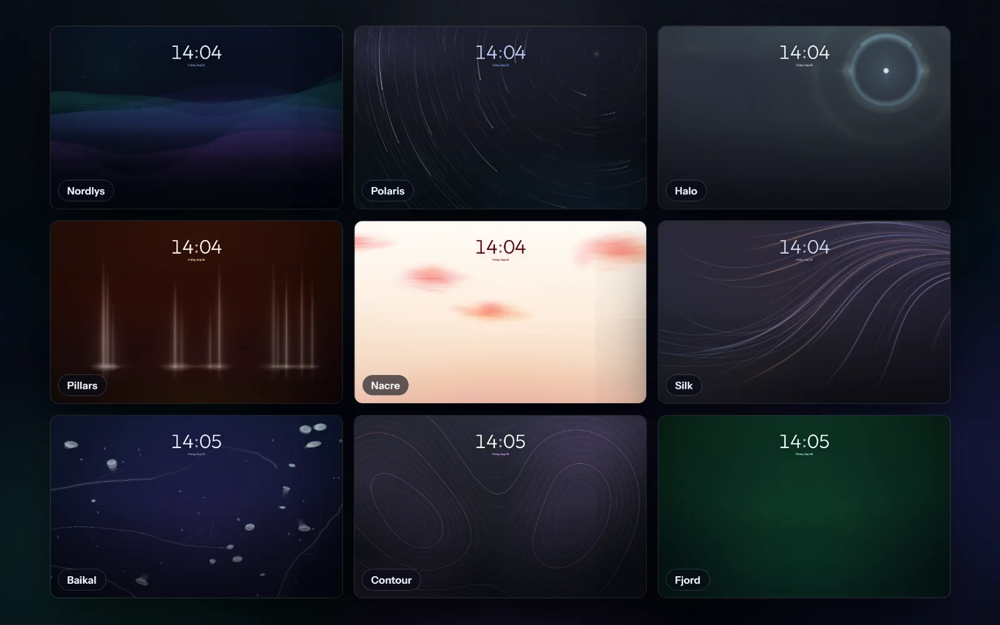

<p align="center">
  
</p>

<h1 align="center">Nordlys</h1>

<p align="center">
  A new tab page with bookmark folders, a dashboard for your day and animated backgrounds.
</p>

<p align="center">
  <a href="https://chromewebstore.google.com/detail/nordlys/fepiibfbbjhaoldgcfpfcikbonnjbfdc">Chrome Web Store</a> ·
  <a href="https://sa1ntsinner.github.io/nordlys-tab/">Website</a> ·
  <a href="PRIVACY.md">Privacy</a> ·
  <a href="CHANGELOG.md">Changelog</a>
</p>

<p align="center">
  
</p>

I wanted a new tab page with my bookmarks and something nice to look at, so I made one.

- Keep bookmarks in folders. Move the folders around, adjust tile size and spacing, and undo changes.
- Pick from 9 animated backgrounds and 21 themes (11 dark, 10 light), or use your own picture or looping video.
- Search with the engine set in Chrome. The box also does math and takes commands after `>`, such as `theme nord`.
- Press Search to find brand icons from Iconify's Simple Icons set. You can also use a site's favicon, an image link or a letter.
- Several profiles (say, Work and Home), and optional sync through your Google account. There's no account of ours: it uses Chrome's own sync.
- A dashboard when you want one: tasks with dates and steps, habits, a focus timer and a full-page focus mode with sounds, notes, weather, world clocks, a countdown, a tab stash, and an Ask card for Chrome's built-in model, your own key or a local model. Drag the cards anywhere and stretch them by the corner. All of it is free.
- Connect the apps you already use: tasks from Todoist, GitHub, GitLab, Trello, Asana, ClickUp, Linear, Jira and Notion, and events from any calendar with an ICS link. Nordlys talks to each app straight from your browser, with a token that stays on your device.
- A folder can mirror a Chrome bookmark folder. Nordlys only reads it.
- It's in English, Russian, Spanish, German, French, Japanese, Chinese and Turkish.
- There's no account and no tracking.

<p align="center">
  
</p>

<p align="center">
  
</p>

## Install

Install it from the [Chrome Web Store](https://chromewebstore.google.com/detail/nordlys/fepiibfbbjhaoldgcfpfcikbonnjbfdc). It also works in Edge, Brave and other Chromium browsers.

Builds for Edge Add-ons and Firefox, and a folder ready for Safari's converter, come from the same code with `npm run ports`. In Firefox the search box uses Firefox's engine; in Safari, which gives extensions no way to do that, you pick an engine once in Settings → General.

To run it from source instead:

1. Download or clone this repo.
2. Open `chrome://extensions` and turn on Developer mode.
3. Click Load unpacked and pick the folder.

## Privacy

Settings and bookmarks stay on your device, and in Chrome's own sync only if you turn sync on. Searches go through Chrome to your chosen search engine when you press Enter. Brand icon searches contact Iconify only after you press Search. Pasted image links may also load online. See [PRIVACY.md](PRIVACY.md) for the full details.

## Development

There's no build step. The extension uses plain JavaScript and CSS.

```sh
npm install
npm test          # lint, unit and browser tests
npm run artwork   # store and site pictures, taken from the running extension
npm run site      # builds the website into .site-dist/
npm run ports     # Chrome, Edge and Firefox packages, and dist/safari
```

Nordlys is still a beta. The version is 2.x because Chrome Web Store versions can only go up. Updates that change how your setup is stored keep a restore point first.

## License

MIT licence. See [LICENSE](LICENSE).
